  

<h3 align="center">👨‍💻 About Me</h3>

<strong>DevOps / Infrastructure Engineer</strong> ☁️

Cloud • Platform Engineering • Kubernetes • Automation • Infrastructure as Code • GitOps • Observability

Currently working with <strong>Enterprise Architecture</strong>, helping design, automate and evolve scalable, highly available and resilient technology platforms across <strong>AWS and Azure</strong>.

My work focuses on infrastructure automation, cloud platforms, Kubernetes ecosystems, CI/CD, GitOps and observability.

 

<strong>Tech Stack</strong>

Kubernetes • AKS • Terraform • Ansible • AAP • Red Hat • Docker • MongoDB Atlas • ArgoCD • GitHub Actions • Jenkins • Prometheus • Grafana

I actively explore the intersection of <strong>AI, Automation and Infrastructure</strong>, focusing on improving engineering productivity, platform reliability and operational efficiency.

 

🎸 Music  •  🎤 Singing  •  💰 Investments

<h3 align="center">🌐 Let's Connect</h3>

  &nbsp;&nbsp;&nbsp;&nbsp;  &nbsp;&nbsp;&nbsp;&nbsp;  

  

