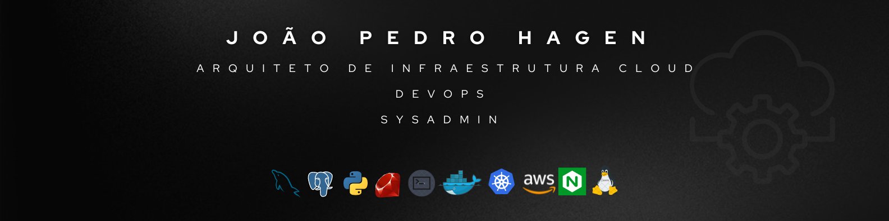

Apaixonado por tecnologia e desafios, sou especialista em infraestrutura de TI (Cloud e On-premise), com foco em automação, observabilidade e alta disponibilidade. Trabalho com Kubernetes, Docker, AWS, Terraform e outras ferramentas essenciais. Utilizo ArgoCD, GitHub Actions e Jenkins para automação de pipelines, além de Prometheus e Grafana para garantir monitoramento e escalabilidade. Fora do mundo tech, adoro cantar, tocar violão e me aventurar no mundo dos investimentos. Sempre pronto para encarar novos desafios e contribuir com projetos que fazem a diferença!

  <i>Dê uma olhada nas minhas redes! Vlw!</i>

